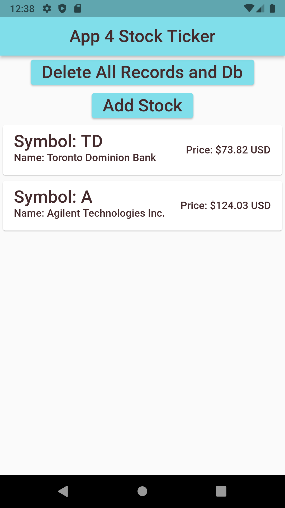

# Assignment 4: Stock Ticker

## Overview

Create a new project and replace the `lib` folder with the supplied one. 

In the `pubspec.yaml` file add the required packages 

```dart
dependencies:
  flutter:
    sdk: flutter
  
  http:
  sqflite:
  path:
```

Once you replace the `lib` folder and update the `pubspec.yaml` file, the project should compile and run as is, even though the functionality of the running app is not complete.

You will see `TODO` items in the given code, that directs where to put your code to complete the assessment. 

When you are happy with your solution `zip` up only the `lib` folder and submit it to Moodle.

## Required Tasks

- Each `TODO:` comment will describe the expected functionality your code is to provide.

- Place your code immediately below the `TODO:` comment.

- `Do NOT change any of the code outside of a TODO: comment`.

### Part 1:

- Modify the following methods of the `SQFliteDbService` class in the `services/db-service.dart` file:
  - `insertStock()` to insert a stock into the database.
  - `updateStock()` to update stock information in the database.
  - `deleteStock()` to delete a stock from the database.

### Part 2:

- Modify the following method of the `HomeView` class in the `views/home.dart` file:
  - `_inputStock()` to insert a stock into the database when the `Add Stock` button is pressed.

## Sample Screen Shots
 



